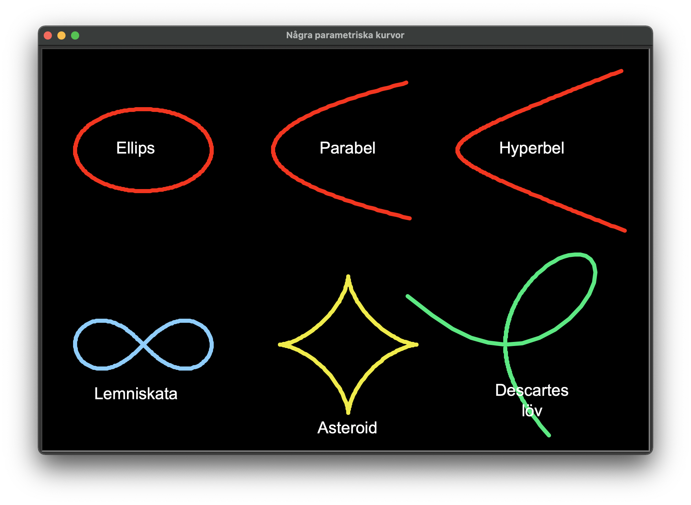

# Övning 2 - Parametriska kurvor
En parametrisk kurva i planet är en kurva som definieras av två ekvationer. T ex gäller för en **ellips** 

För att rita kurvan kan man skapa en lista med en massa tal i intervallet som *t* ska ligga inom; därefter så beräknas ett *x*- och ett *y*-värde för varje tal *t* i listan. Talen *a* och *b* är godtyckliga, de kommer att bestämma form och storlek på ellipsen. Om *a* och *b* är lika stora kommer figuren att bli en cirkel (vilket är ett specialfall av en ellips).

Nedanstående bild visar några olika kurvor skapade av parametriska ekvationer, gjorda i Turtle. För att komma igång [finns en startfil](parametriska_kurvor.py) som ritar ellipsen.

Du ska skapa något liknande denna bild med Python och Turtle. Här är de parametriska ekvationerna för respektive graf (ellipsen ovan):

### Parabel

Här får man pröva sig fram i vilket intervall *t* ska ligga, det beror på hur stor man vill ha parabeln. I exemplet ovan så är intervallet mellan -2 och 2. En kaströrelse i t ex gravitationsfältet följer en parabel.

### Hyperbel

Funktionerna cosh och sinh är s.k *hyperboliska* funktioner. I Ma4 så visas dessa båda funktioners definitioner och en identitet som kallas den "hyperboliska ettan" (som liknar den "trigonometriska ettan"). Här använder vi dem enbart till att rita grafen som kallas för hyperbel. [Här kan den som är intresserad läsa mer om hyperboliska banor som t ex kometer kan beskriva](https://en.wikipedia.org/wiki/Hyperbolic_trajectory).

### Lemniskata

Ser ut som en liggande åtta!

### Asteroid

Ser lite ut som en stjärna!

### Descartes löv

Eftersom *t* måste vara skilt från 1 får man tänka till hur man ska hantera denna parametriska ekvation för att få med hela "lövet" enligt bilden ovan. Ett tips är att göra två intervall, ett som innehåller tal som är mindre än -2 och ett som innehåller tal större än -2. Experimentera med sådana delar.

 Man märker även att vissa delar i lövet går väldigt snabbt för datorn att rita, medan andra går betydligt långsammare. Det är inte enbart för att det är tunga beräkningar för datorn, utan mest för att hastigheten ligger i de parametriska kurvornas natur. Om vi [plottar derivatan i *x*-led](https://www.wolframalpha.com/input/?i=differentiate+t%2F%281%2Bt%5E3%29) så ser vi att den ligger nära noll för stora belopp på negativa tal och även stora positiva tal (gör gärna motsvarande plot i *y*-led). Derivatan är ett mått på hastigheten, så där den ligger nära noll kommer också hastigheten på uppritningen med denna metod att göra det.
 
 Rent konkret betyder det att för ett och samma intervall (t ex om *t* ökar med 0.1) så kommer linjen att bli olika lång beroende på var i intervallet vi är. När derivatan närmar sig noll kommer också längden på den del av linjen som ritas i intervallet att närma sig noll, därmed så går det långsammare. Detta gäller för alla kurvor som ritas genom parametriska ekvationer.